下面是一份可直接放入 docs/sequence-diagrams.md 的完整工作流时序集合（Mermaid + 解释）。我把所有与数据/状态变更相关的操作都列成 12 个核心场景，并在每段下加了 流程验证要点，方便你在单元测试或 Postman 测试时逐项核对。

⸻

目录
	1.	题目上传（problem_ingest）
	2.	题干 LaTeX 手动修改（latex_refine）
	3.	节点切换（node_select）
	4.	块编辑（block_edit）
	5.	块删除（block_delete，级联）
	6.	块解析（block_parse）
	7.	提示思路（suggest_next_moves）
	8.	继续解答（solve_next_step，手动模式）
	9.	继续解答（solve_next_step，Auto-select = false + 候选挑选）
	10.	全部解答（solve_to_end，Auto-select = true）
	11.	总结（summarize_history）
	12.	解析答案导入（answer_to_steps）

⸻

0 通用图例

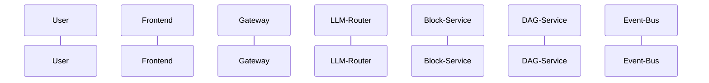

⸻

1. 题目上传（problem_ingest）

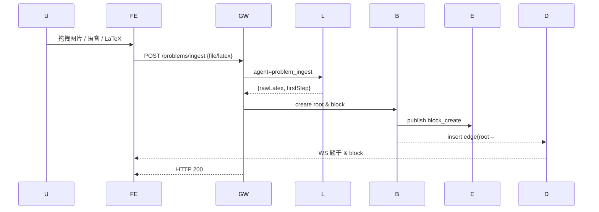

**验证要点**

| 检查     | 期望                                        |
| :------- | :------------------------------------------ |
| Event 表 | upload, model_call, block_create 三条       |
| DagState | currentNode = block#1                     |
| Frontend | BlockList 出现首块；DagCanvas 显示根–#1 |

⸻

2. 题干 LaTeX 手动修改（latex_refine）

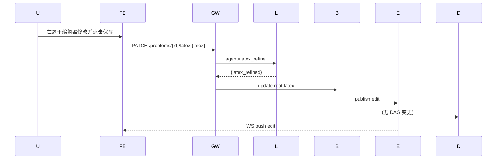

**要点**: 只改題幹文本，不改 DAG；如果需重新解析则前端再发 /blocks/:id/parse。

⸻

3. 节点切换（node_select）

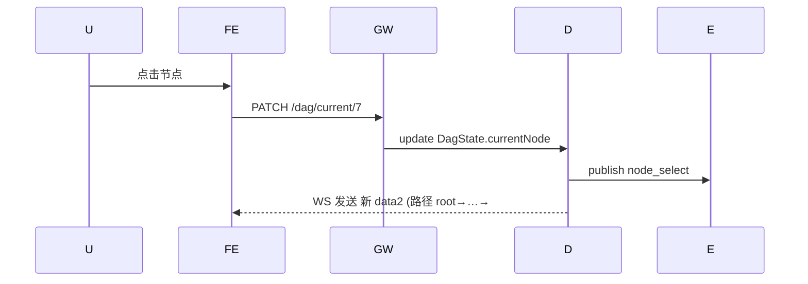

**要点**: data2 刷新 UI；data1/data3 不改。

⸻

4. 块编辑（block_edit）

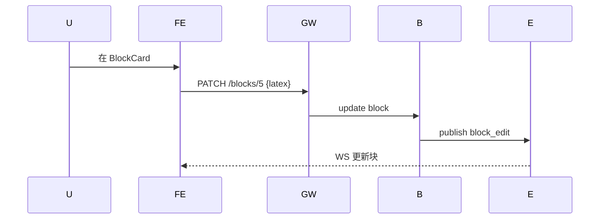

⸻

5. 块删除（block_delete 级联）

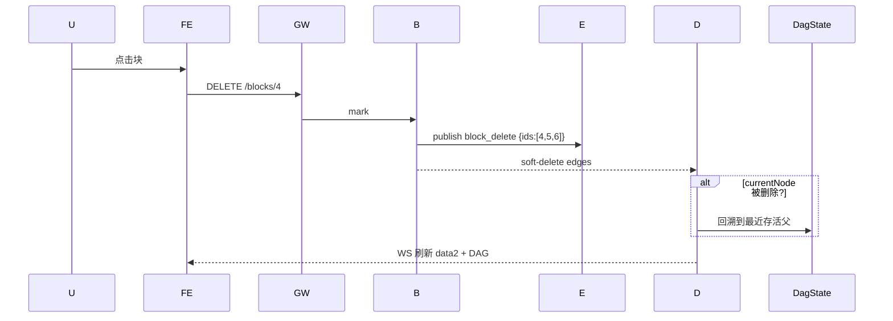

⸻

6. 块解析（block_parse）

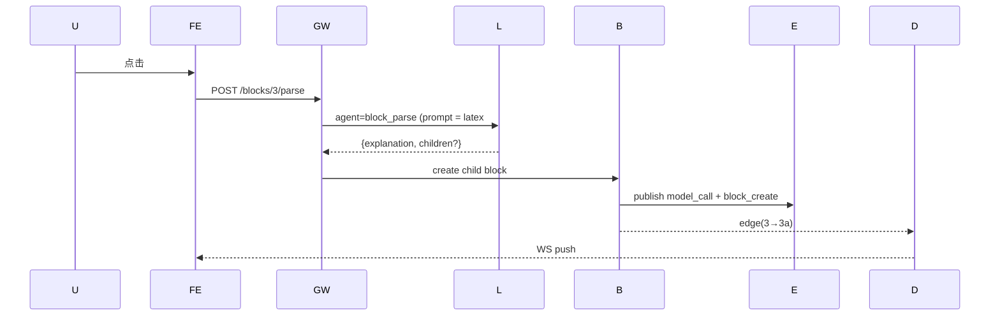

⸻

7. 提示思路（suggest_next_moves）

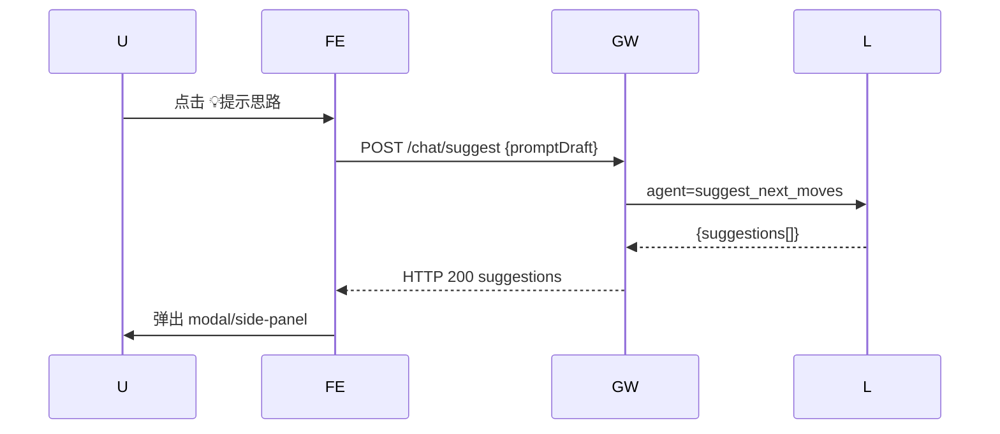

**要点**: 不写块、不动 DAG，不触发 block_create。

⸻

8. 继续解答（solve_next_step，Manual 模式）

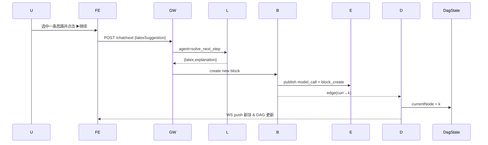

⸻

9. 继续解答（solve_next_step，Auto-select =false + 候选挑选）

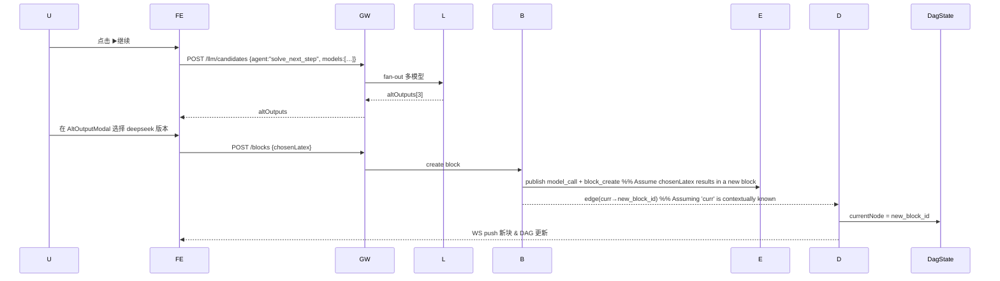

⸻

10. 全部解答（solve_to_end，Auto-select =true）

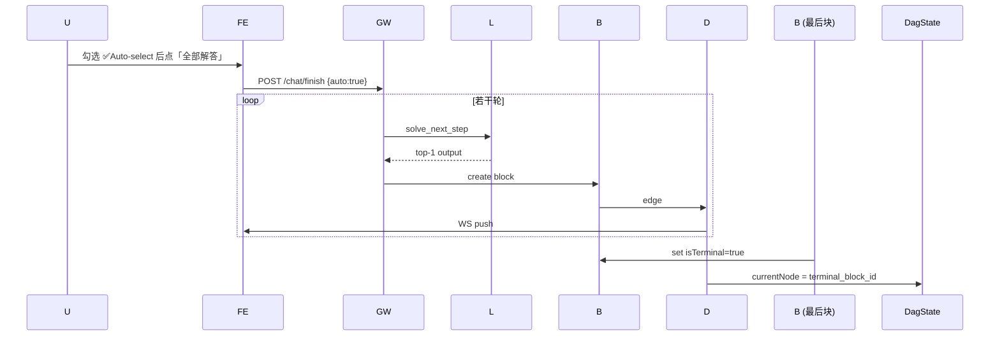

⸻

11. 总结（summarize_history）

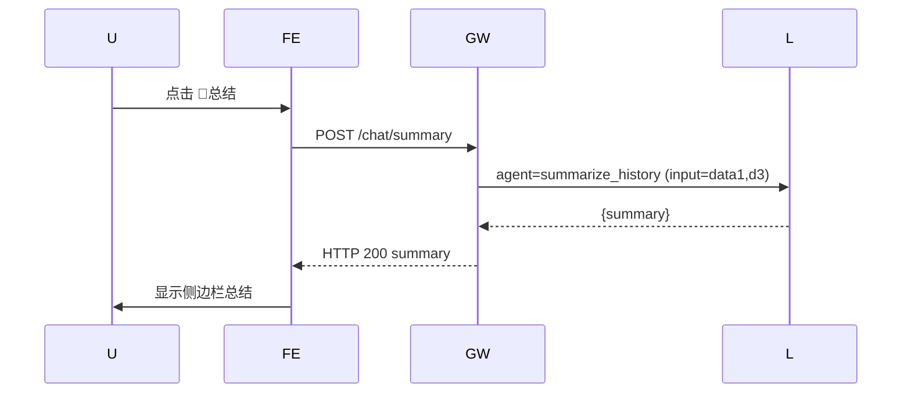

⸻

12. 解析答案导入（answer_to_steps）

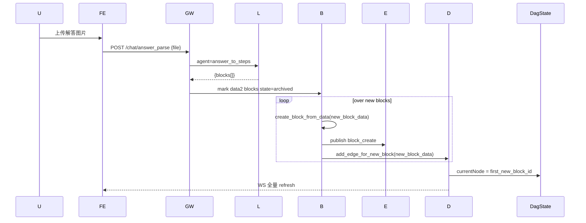

⸻

### DAG 实时呈现与交互 —— 推荐现成工具

| 方案             | 为什么合适                                                                                                 | 关键 API / 功能                                                                                                |
| :--------------- | :--------------------------------------------------------------------------------------------------------- | :------------------------------------------------------------------------------------------------------------- |
| React Flow (MIT) | • React 生态；• 内建缩略图、自动布局（dagre / elk）；• 节点/边类型可自定；• 2 万节点性能可接受                    | `useReactFlow()` 动态增删节点；`fitView` 居中；`onNodeClick` → PATCH /dag/current；Background + MiniMap           |
| ECharts Graph    | • 如果想用非 React 页面也可；• 力导向 / 层次布局可选；• 提供 tooltip/缩放                                        | `setOption({ series: [{type:'graph',data,links}] })`; WS 到来时 diff patch                                   |
| Cytoscape.js     | • 经典图工具；事件丰富；• 集成 dagre / cola layout；• Svelte/Vue/React 均可                                  | `cy.add()`；`cy.on('tap', 'node', ...)`                                                                       |

**推荐实践**
	1.	先用 React Flow + dagre：几乎零配置即可得正交层次图。
	2.	WebSocket 推送的节点/边 diff → `reactFlowInstance.addNodes()` / `addEdges()`。
	3.	将 `currentNode` 高亮：`setNodes(nodes => nodes.map(n=>({...n,selected:n.id===current})))`。
	4.	折叠/展开子树：用 Compound Node 或给节点加"+"/"-"句柄，递归隐藏子孙节点。

⸻

### 流式输出到 data2 的实现关键

```python
# dag_service.py
async def stream_updates(problem_id: UUID):
    async for evt in event_bus.subscribe(problem_id): # Assuming event_bus has a subscribe method
        if evt.type in {"block_create","block_delete","node_select"}:
            path = calc_current_path(problem_id)  # data2
            dag  = fetch_dag_meta(problem_id)     # for DagCanvas
            # yield sse_pack({"path": path, "dag": dag, "evt": evt}) # sse_pack needs to be defined
            # For SSE, content should be formatted like "event: message
data: JSON_STRING

"
            yield f"event: update\ndata: {json.dumps({'path': path, 'dag': dag, 'evt': evt.dict()})}\n\n"

```
**前端**: `useEventSource` 钩子实时合并 state 并刷新 React-Flow 与 BlockList，保证 `data2` 与 `currentNode` 随时同步。

⸻

### 最后提醒
	•	Mermaid 图可直接复制到 GitHub README / HackMD 预览；VS Code 插件也能渲染。
	•	所有 sequence 图均确保 事件写入 → 服务写 DB → DagState 校正 → WS 推前端 这一顺序一致。
	•	若后期出现跨标签页协同，可把 Event-Bus 替换为 Postgres LISTEN/NOTIFY 或 Y.js CRDT，同样兼容 React Flow。

如还需更多细节（布局参数、WS 协议示例、Orchestrator 测试脚本等），随时告诉我！
